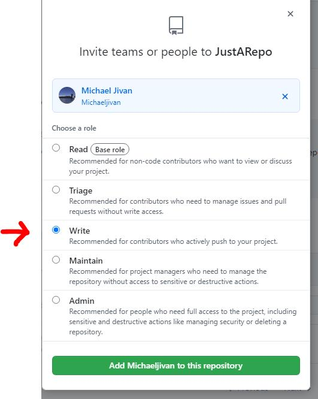

# Onboarding
## Agencies
All California government agencies (state/county/city) are encouraged to actively engage with the CodeCA OpenSource community.
 
## Getting started  

1. [Set up GitHub organization](https://docs.github.com/en/github/setting-up-and-managing-organizations-and-teams/about-organizations) (ex: [California Department of Technology](https://github.com/CDTgithub), [CA Office of Digital Innovation](https://github.com/Office-of-Digital-Innovation/), [Child Welfare Digital Services](https://github.com/ca-cwds))
2. Create a [code-ca.json](https://codecaopensource-playbook.readthedocs.io/en/latest/workflow/#codejson) file in the following format to provide a list of your agency's organizations.  
      ```
    { 
      "GitHubOrganizations": [ 
        "Office-Of-Digital-Innovation", 
        "StateOfCalifornia" ,
        "CA-CODE-Works",
        "chhsdata",
        "CodeCAOpenSource"
      ] 
    }
      ```

3. Place the [code-ca.json](https://codecaopensource-playbook.readthedocs.io/en/latest/workflow/#codejson) file in the root of the agency website  
    ```www.example.ca.gov/code-ca.json```

4. Add [codecasupport](https://github.com/codecasupport) as a collaborator with Write permissions on the repository you wish to add.


5. You will now see your agency and organizations listed on the [CodeCA OpenSource Explore page](https://as-cdt-pub-codeca-ww-p-001-uat.azurewebsites.net/Explore)