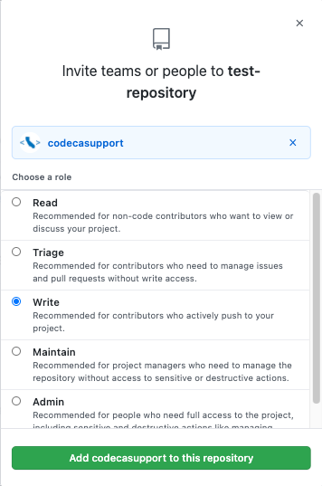

# Onboarding
## Agencies
All California government agencies (state/county/city) are encouraged to actively engage with the CodeCA OpenSource community.
 
## Getting started 
1) An agency's Directory Listing Coordinator will verify the agency website in COLD [https://cold.govops.ca.gov](https://cold.govops.ca.gov)  

2) Create a [GitHub organization](https://docs.github.com/en/github/setting-up-and-managing-organizations-and-teams/about-organizations) (ex: [California Department of Technology](https://github.com/CDTgithub), [CA Office of Digital Innovation](https://github.com/Office-of-Digital-Innovation/)).
  The GitHub organization name is what needs to be included in the [code-ca.json](https://codecaopensource-playbook.readthedocs.io/en/latest/workflow/#codejson) file, and can be found in the URL of the organization's GitHub account.
```
www.github.com/yourOrg1
```
  \
3) Create a [code-ca.json](https://codecaopensource-playbook.readthedocs.io/en/latest/workflow/#codejson) file in the following format to provide a list of your agency's organizations.
```
{ 
  "GitHubOrganizations": [ 
    "yourOrg1", 
    "yourOrg2" ,
    "yourOrg3",
  ] 
}
```
  \
4) Place the [code-ca.json](https://codecaopensource-playbook.readthedocs.io/en/latest/workflow/#codejson) file in the root of the agency website.   
```
www.example.ca.gov/code-ca.json
```
  \
5) Add CodeCA OpenSource's GitHub account, [codecasupport](https://github.com/codecasupport), as a collaborator with Write permissions for the repository you wish to add.


6) You will see your agency and organizations listed on the [CodeCA OpenSource Explore page](https://as-cdt-pub-codeca-ww-p-001-uat.azurewebsites.net/Explore) in 1-2 business days.