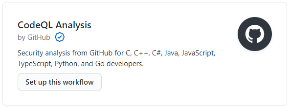

# Onboarding
## Agencies
All California government agencies (state/county/city) are encouraged to actively engage with the CodeCA OpenSource community.
 
## Getting started 
1) An agency's Directory Listing Coordinator will verify the agency website in COLD [https://cold.govops.ca.gov](https://cold.govops.ca.gov)  

2) Create a [GitHub organization](https://docs.github.com/en/github/setting-up-and-managing-organizations-and-teams/about-organizations) (ex: [California Department of Technology](https://github.com/CDTgithub), [CA Office of Digital Innovation](https://github.com/Office-of-Digital-Innovation/)).
  The GitHub organization name is what needs to be included in the [code-ca.json](https://codecaopensource-playbook.readthedocs.io/en/latest/workflow/#codejson) file, and can be found in the URL of the organization's GitHub account.
```
https://www.github.com/yourOrg1
```


3) Create a [code-ca.json](https://codecaopensource-playbook.readthedocs.io/en/latest/workflow/#codejson) file in the following format to provide a list of your agency's organizations.
```
{ 
  "GitHubOrganizations": [ 
    "yourOrg1", 
    "yourOrg2" ,
    "yourOrg3",
  ] 
}
```
 

4) Place the [code-ca.json](https://codecaopensource-playbook.readthedocs.io/en/latest/workflow/#codejson) file in the root of the agency website.   
```
www.example.ca.gov/code-ca.json
```

5) You will see your agency and organizations listed on the [CodeCA OpenSource Explore page](https://as-cdt-pub-codeca-ww-p-001-uat.azurewebsites.net/Explore) in 1-2 business days.

_Note: The following steps are optional, but will benefit your agency by providing more details about its open source projects, and display the results of any code scanning performed on the repository. This will increase the likelihood that your agency's open source projects will be reused or gain additional collaborators, and is more in line with the spirit of open source development. Choosing not to add [codecasupport](https://github.com/codecasupport) as a collaborator will list your repository as Unverified_
  
___
6) Add CodeCA OpenSource's GitHub account, [codecasupport](https://github.com/codecasupport), as a collaborator with Write permissions for the repository you wish to add. 

7) [Enable code scanning alerts ](https://docs.github.com/en/github/finding-security-vulnerabilities-and-errors-in-your-code/about-code-scanning) from the Security tab of your GitHub repository by clicking the "Set up code scanning button" in the lower right of the screen

8) Select a code scanning tool from the available providers. CodeQL Analysis is recommended, as it is free and created by GitHub.

9) After collaborating with [codecasupport](https://github.com/codecasupport) and enabling code scanning, your repository's listing will look similar to this example.


